<!-- ✨ Profile banner — animated SVG lives in ./assets/header.svg -->

  &nbsp;
  &nbsp;
  

## About

I've shaped open-source design systems like **[gluestack](https://gluestack.io)**, used by thousands of teams, helped build **[RapidNative](https://rapidnative.com)** (prompts to real React Native apps), and now lead AI product at **[Natural Heroes](https://naturalheroes.nl)**. On the side I build and sell **[thefrontkit](https://thefrontkit.com)**, production-ready Next.js app kits. I'm in the codebase as much as the roadmap.

## Tech I work with

  
  
  
  
  
  

  
  
  

## What you'll find here

- 🧰 **[thefrontkit](https://thefrontkit.com):** Next.js business app templates
- ⚛️ Open-source design systems and dev tooling (gluestack, NativeBase, BuilderX)
- 🤖 AI agents, automation, and eval experiments

## Education

- **Deakin University, Australia:** Master of Data Science *(expected Feb 2027)*
- **UT Austin:** Post Graduate Program in Artificial Intelligence & Machine Learning *(Nov 2024 – Nov 2025)*
- **XLRI Jamshedpur:** Advanced Product Management *(Apr 2021 – Apr 2022)*
- **PES University:** BE, Computer Science *(Aug 2008 – Aug 2012)*

## Get in touch

- Website: **[gauravguha.com](https://www.gauravguha.com)**
- LinkedIn: **[in/gauravguha](https://linkedin.com/in/gauravguha)**
